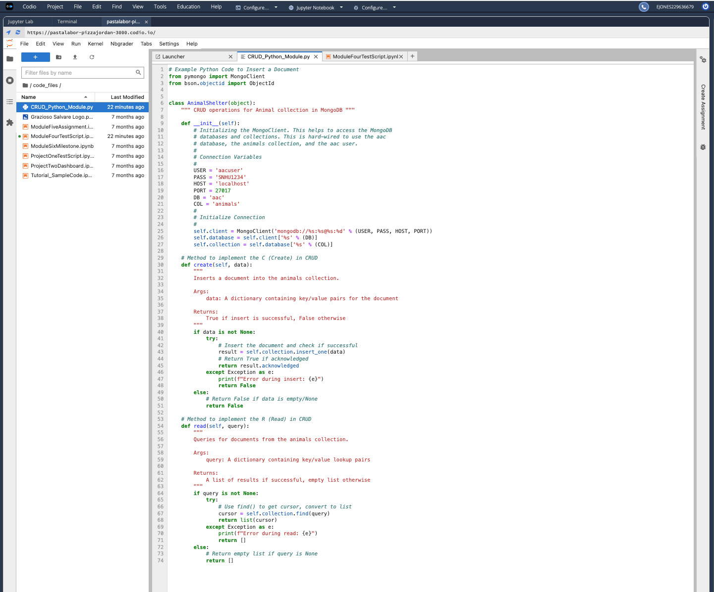

# CS 340 README: CRUD Python Module

Ebony Jones

## About the Project

This project is a Python module that provides CRUD (Create, Read, Update, Delete) operations for managing animal records in a MongoDB database. The module is designed to work with the Austin Animal Center (AAC) database, which contains information about animals in the shelter system. For this milestone, I have implemented the Create and Read functionality, with Update and Delete operations planned for future development.

## Motivation

The purpose of this project is to create a reusable Python module that can be integrated into larger applications, such as a web-based dashboard for the Grazioso Salvare organization. By abstracting the database operations into a dedicated class, the code becomes more maintainable, testable, and easier to understand. This modular approach also allows other developers to use the same CRUD functionality without needing to understand the underlying MongoDB connection details.

## Getting Started

To use this CRUD Python module, you will need to have the following set up:

**Database Setup:** In the Module Three milestone, I set up a MongoDB database named "aac" with a collection called "animals." The database contains animal shelter data imported from a CSV file. I also created a user account "aacuser" with readWrite permissions to securely access the database.

**User Authentication:** The module uses username and password authentication to connect to MongoDB. The credentials are stored as variables within the class and are passed to the MongoClient for secure database access.

**Module Development:** I created the AnimalShelter class with create() and read() methods. The main challenge I encountered was ensuring proper error handling and return values. I solved this by using try-except blocks and returning appropriate boolean values (True/False) for create operations and lists for read operations. This makes the module more robust and easier to debug.

## Installation

The following tools and libraries are required to use this module:

- **Python 3.x:** The programming language used to write the module. Python was chosen because it is widely used in data science and has excellent MongoDB support.

- **PyMongo:** The official MongoDB driver for Python. Install using: `pip install pymongo`. I chose PyMongo because it is the recommended library for MongoDB operations in Python and provides a straightforward API.

- **MongoDB:** The NoSQL database system. MongoDB was selected because it stores data in flexible, JSON-like documents, which is ideal for the varied animal record data.

- **Jupyter Notebook:** Used for testing the module interactively. Jupyter was chosen because it allows for step-by-step testing and immediate visualization of results.

## Usage

This section demonstrates how the CRUD Python module works and how it can be used.

### Code Example

The AnimalShelter class provides two main methods:

**create(data):** Inserts a new document into the animals collection. Takes a dictionary of key/value pairs and returns True if successful, False otherwise.

**read(query):** Queries documents from the animals collection. Takes a dictionary of search criteria and returns a list of matching documents.

Example usage:
```python
from CRUD_Python_Module import AnimalShelter

shelter = AnimalShelter()

# Create a new animal record
new_animal = {"name": "Test Dog", "animal_type": "Dog"}
result = shelter.create(new_animal)  # Returns True

# Read animal records
dogs = shelter.read({"animal_type": "Dog"})
```

### Tests

I tested the module using a Jupyter Notebook (ModuleFourTestScript.ipynb). The test script performs the following:

- Creates an instance of the AnimalShelter class
- Tests the create() method by inserting a new test animal record
- Verifies the insertion by using read() to retrieve the newly created record
- Tests read() on existing data by querying for Labrador Retrievers

**Test Results:** The CREATE test returned True, confirming successful insertion. The READ test found the newly created record and also successfully retrieved 55 existing Labrador Retriever records from the database.

### Screenshots



*Figure 1: The AnimalShelter class with create() and read() methods*


*Figure 2: Successful execution of the test script showing CREATE and READ operations*

## Contact

Ebony Jones
